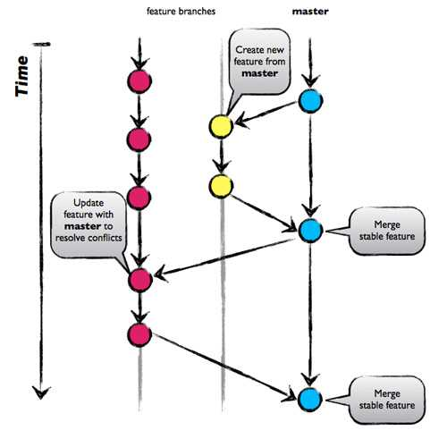
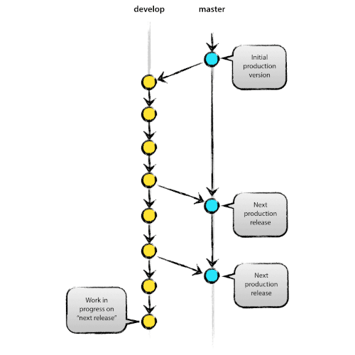
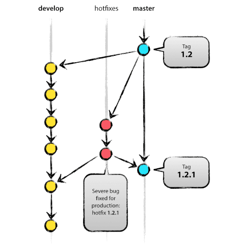

---
# tutorial --> https://www.youtube.com/watch?v=EzQ-p41wNEE
marp: true
theme: gaia
# theme: uncover
#theme: graph_paper
class:
  - invert
#  - lead
style: |
    h1 {
        color: white;
    }
    h2 {
        color: #ffffaa;
    }
paginate: true
# backgroundImage: url('https://url/to/cutoff/image.png')
# math: mathjax
# header: 'header'
# footer: 'footer'
title: Git Workflow and Conventions for Embedded Systems
description: Basics, Branching, and Commit Message Conventions
author: Pasakorn Tiwatthanont
keywords: git, branching convention, commit message
# url: https://marp.app/
# image: https://marp.app/og-image.jpg
---

# Git: Workflow and Conventions for Embedded Systems

Basics, Branching, and Commit Message Conventions

<span style="color:blue;">**Presented by**</span>
Pasakorn Tiwatthanont [10/2024]

<!-- _paginate: hide -->

<!--
วันนี้ขอนำเสนอ  delay{0.5}
Git Workflow and Conventions for Embedded Systems  delay{0.5}
เมื่อให้ทีมทำงานร่วมกัน อย่างมีประสิทธิภาพ  delay{0.5}
สำหรับเราชาว Embedded System Developers  delay{0.5}
 -->

---

## Outlines

- **Basic Workflow Steps**
- **Branching and the Convention**
- **Commit Message Convention**

<!--
สามเรื่องที่จะพูดถึง  delay{0.5}  
1. พื้นฐานและแนวคิด การใช้งาน Git  delay{0.5}  
2. การทำงานร่วมกัน หลักการ branching. ทำเมื่อไร และควรทำอย่างไร  delay{0.5}  
และ 3. เพื่อการ maintenance. ต้องใช้ commit message ที่เข้าใจง่าย
  จะทำให้ทีมทำงานง่าย  delay{0.5}  
 -->

---

## Introduction to Git Workflow

- **What is Git Workflow?**
  - A series of steps to manage code changes and collaborate effectively.
- **Why it’s Important?**
  - Keeps codebase organized
  - Enables smooth collaboration
  - Minimizes conflicts and errors

<!--
โดยสรุป  delay{0.5}  
Git workflow. คือลำดับขั้นตอนการทำงาน ที่ทำให้ การทำงานร่วมกัน สอดประสาน  delay{0.5}  
ซึ่งสำคัญมาก ทั้งในตอนที่นำ features. มารวมกัน
  และตอนที่ทีม ต้องกลับมา maintainance code  delay{0.5}  
 -->

---

## Basic Git Workflow Steps

1. **Clone the Repository**
   - Start by cloning, to have a local copy.
2. **Create a New Branch**
   - Each branch has just one objective (feature or fix).
3. **Make Changes & Commit Regularly**
   - Commit often, with small changes and meaningful messages.

<!--
พื้นฐานแล้ว. ลำดับขั้นตอนการใช้งาน Git หลักๆมี 6 ข้อ  delay{0.5}  
เราจะลองพิจารณา 3 ข้นแรก  delay{0.5}  
พร้อมกับลอง practice ผ่าน command-line กัน  delay{0.5}  

ข้อแรก Git clone. คือการนำ code ลงมาจาก repository  delay{0.5}  
ข้อสอง Git branch. คิดการแตกกิ่งออก เพื่อแก้ไขตามเป้าหมาย  delay{0.5}  
ข้อสาม Git commit. คือการบันทึก changes ที่เกิดขึ้น พร้อมกับคำอธิบาย  delay{0.5}  

ok. ไปลองใน command-line กัน ก่อนจะกลับมาต่อข้อที่เหลือ  delay{0.5}  
 -->

---

## Basic Git Workflow Steps (cont.)

4. **Sync with the Main Branch Regularly**
   - Pull to avoid conflicts.
5. **Push Your Branch to Remote**
   - Push your changes (commits) when you’re ready for review.
6. **Create a Pull Request (PR), then Merge**
   - Get feedback and approval for your changes before merging.

<!--
สำหรับ 3 ข้อที่เหลือ  delay{0.5}  

ข้อสี่ Git pull. คือการรับความเปลี่ยนแปลง ที่อาจเกิดขึ้นจาก repository  delay{0.5}  
ข้อห้า Git push. คือการส่งความเปลี่ยนแปลง ขึ้นไปบันทึกที่ repository  delay{0.5}  
ข้อหก การ pull request, คือการขอให้ระบบ เช่น Gitlab.
  ทำบันทึก แจ้งให้ 'ผู้ดูแล' ทราบว่า
  มี branch ที่เราต้องการ ให้รวมเข้ากับ branch หลัก  delay{0.5}  
  ซึ่งมักสอดคล้องกับเหตุผล ตาม issue ที่เราขอแตก branch ออกมา  delay{0.5}  

ok. ลองไปดูในการใช้งาน command-line กัน  delay{0.5}  
 -->

---

## Git GUI Clients – Alternatives to the CLI

1. **GitKraken** – Intuitive, cross-platform, with built-in support for GitFlow and visualizations. (Linux, MacOS, Windows)
2. **Sourcetree** – Comprehensive interface for advanced Git features, by Atlassian. (MacOS, Windows)
3. **GitK** – Fast, simple, and free for Linux users. (Linux, MacOS, Windows)

<!--
ทีนี้ ก่อนจบเรื่องพื้นฐาน ขอฝาก Git GUI client ไว้ดังนี้  delay{0.5}  

ตัวแรก GitKraken. คือ the best. แต่ต้องจ่ายเงิน
หากจะนำมาใช้กับ private repository  delay{0.5}  

ตัวที่สอง Sourcetree. เป็นที่นิยมเหมือนกัน
สามารถใช้งานกับ private repository ได้จำนวนหนึ่ง
แต่ไม่มีบน Linux  delay{0.5}  

ตัวที่สาม GitK. เป็น opensource ที่พอใช้งานได้. ไม่มีข้อจำกัด
แต่ interface ออกแยยไม่ค่่อยดี
หลักๆไว้ดู topology ระหว่าง branches ได้  delay{0.5}  

ถ้าเพิ่มเริ่มต้น. ใช้ GitK ก่อนก๊ได้  delay{0.5}  
 -->

---

## When Do We Need Branching?

**Collaborative Development**: Each team member can work on their own branch to avoid conflicts.

- **Feature Development**
  - Isolate new features to avoid disrupting the main codebase.
- **Bug Fixes**
  - Use separate branches for each bug to keep fixes organized.
- **Experimentation & Prototyping**
  - Keep experimental code on its own branch.

<!--
หลังจากทราบเรื่อง การบันทึกความเปลี่ยนแปลงด้วย Git แล้ว  delay{0.5}  
คำถามถัดไปคือ branching. เมื่อไร  delay{0.5}  

เบื้องต้น เรา branch เพื่อทำงานร่วมกัน โดยไม่เกิด conflict  delay{0.5}  
เราสร้าง 1 branch. เพื่อรองรับ 1 issue. นั่นคือ 1 จุดมุ่งหมาย  delay{0.5}  

ซึ่งโดยความนิยม จะแบ่ง categories ได้ประมาณ 3 คือ  delay{0.5}  
1. feature branch. เพื่อสร้าง functions ใหม่  delay{0.5}  
2. bugfix branch. เพื่อแก้ไขข้อผิดพลาด  delay{0.5}  
3. experiment branch. เพื่อทดลองอะไรบางอย่าง ซึ่งอาจจะไม่ถูก merged กลับก็ได้  delay{0.5}  
 -->

---



**Feature Branches**
Isolate new features to avoid disrupting the main codebase.

<!--
ok. เพื่อให้เห็นภาพ  delay{0.5}  

ภาพแรกคือ ตามเป้าหมายของการ branch.
นั่นคือไม่ให้เกิด conflict ระหว่าง developers กันเอง  delay{0.5}  

จะเห็นว่า ระหว่างที่นายแดงแก้ไข  delay{0.5}  
นายเหลือง ก็สามารถทำงานได้ และ merge กลับเข้าไป  delay{0.5}  
ส่วนนายแดง  delay{0.5}  
ได้ merge code ของนายเหลืองเข้ามา ขณะที่กำลังแก้ไข  delay{0.5}  
จากนั้นจึง merge กลับเข้า master ในท้ายที่สุด  delay{0.5}  

ข้อสังเกต  delay{0.5}  
user ซึ่งใช้งาน master branch. จะได้ code ใหม่ไปใช้งานทันที
ทำให้เสี่ยงกับ business  delay{0.5}  
 -->

---



**Develop Branch**
`feature/<  delay{0.5}  .>` is branched to develop a new feature,
which will be merged on `develop`, released on `main`.

<!--
ดังนั้น  delay{0.5}  
จึงมีการแยก ระหว่าง branch 'develop'. และ 'master'  delay{0.5}  

การแตก brnach. เพื่อพัฒนา จะทำบน 'develop' ทั้งหมด  delay{0.5}  
จนเมื่อจะส่งมอบให้ user. ใช้งาน  delay{0.5}  
จึงค่อยมีการ merge เข้าไปยัง master  delay{0.5}  
 -->

---



**Bugfix Branch**
`bugfix/<...>` is binded with one specific issue.

<!--
สำหรับการแก้ไขข้อผิดพลาด  delay{0.5}  
เราอาจเลือกที่จะแก้จาก branch 'master'. หรือ branch 'develop'. ก็ได้  delay{0.5}  
ขึ้นอยู่กับความเร่งด่วน  delay{0.5}  

ต่อเมื่อการแก้ไขเสร็จแล้ว. ก็ค่อย merge กลับเข้าไปยัง 'develop' และ 'master'  delay{0.5}  
ซึ่งทั้งนี้. จะไม่มีการ merge 'master' กลับเข้า 'develop' ให้เสียหลักการ  delay{0.5}  
 -->

---

## Branch Naming Conventions

- **Feature**: `feature/<description>`
  - Example: `feature/1-led-running`
- **Bug Fix**: `bugfix/<description>` or `fix/<description>`
  - Example: `fix/2-uart-unstable`
- **Documentation**: `docs/<description>`
  - Example: `docs/3-update-readme`

**Note**: always put an issue number in front of the description.

<!--
สุดท้ายของหัวข้อที่สอง  delay{0.5}  
นี้คือการสรุป naming convention ของ branch  delay{0.5}  

เริ่มต้นด้วย category.
ซึ่งแยกได้ 3 categories. ตาม objectives ที่นำเสนอมาคือ  delay{0.5}  
feature., bugfix., และ document  delay{0.5}  

ต่อมา  delay{0.5}  
หลัง slash.  delay{0.5}  
ตัวเลขที่จะโยงกลับไปยัง issue. และชื่อ  delay{0.5}  
ซึ่งมีกติกาคือ small-cap และ hyphen  delay{0.5}  
 -->

---

## Commit Message Convention

- **Format**:

  ```xml
  <type>(<scope>): <subject>
  <body> (optional)
  <footer> (optional)
  ```

- **Why Commit Conventions Matter?**
  - Helps track changes easily
  - Provides context to team members
  - Simplifies debugging and maintenance

<!--
หัวข้อสุดท้าย  delay{0.5}  
เรื่อง Commit message convention  delay{0.5}  
หลักการคือ. ต้องทำให้ค้นหาได้ และเข้าใจได้  delay{0.5}  
 -->

---

## Commit Message Structure

- **Scope** (optional):
  - Specifies the area of the code affected, e.g., `LED`, `IO`, or `UART`.
- **Subject**:
  - Brief, imperative description of the change.
- **Body** (optional):
  - Detailed explanation of what was changed and why.
- **Footer** (optional):
  - References issue IDs or highlights breaking changes.

<!--
ภายใน message. จะประกอบด้วย scope., subject., body., และ footer  delay{0.5}  

scope. และ subject. เป็นส่วนสำคัญ  delay{0.5}  
- scope. จะระบุส่วน module. ของ code. ที่ถูกกระทบจากการแก้ไข  delay{0.5}  
- subject. คือคำอธิบายที่ส้้นที่สุด สำหรับ changes. ใน commit. นั้น  delay{0.5}  

ส่วน body. และ footer. จะมีหรือไม่ก็ได้  delay{0.5}  
- body. จะขยายความ subject. เริ่มด้วยที่มาที่ไปของปัญหา., วิธีการแก้ไข., และอื่นๆ  delay{0.5}  
- footer. จะเชื่อมโยงไปยัง issue. ที่เกี่ยวข้อง  delay{0.5}  
 -->

---

## Types of Commit Messages

- **feat**: New feature – `feat(LED): add LED running`
- **refactor**: Easier to understand – `refactor(UART): small-capitalize var`
- **fix**: Bug fix – `fix(IOC): pull-up unused pins`
- **test**: Adding tests – `test(UART): add tests`
- **docs**: Documentation – `docs: update setup instructions`
- **chore**: Etc. – `chore: add EEPROM cleaner script`

<!--
ถัดมา. ลองมาดูตัวอย่าง แยกตาม type  delay{0.5}  

1. feat. เป็น commit เพื่อพัฒนา feature.
  ตัวอย่าง feature ของ module LED เพื่อทำไฟวิ่ง  delay{0.5}  
2. refactor. เพื่อทำให้เข้าใจ code ได้ดีขึ้น.
  ตัวอย่าง refactor code ใน module UART. ให้ inside variables ทั้งหมด. เป็นชื่อตัวเล็ก  delay{0.5}  
3. fix. เพื่อซ่อมข้อผิดพลาด.
  เช่น ด้วยการ reconfigure ให้ CubeMX ใส่ pullup ให้ unused pins  delay{0.5}  
4. test. เช่น การสร้างทดสอบ ให้ module UART  delay{0.5}  
5. docs. เป็น commit ที่แก้ไขเอกสาร อธิบาย code หรือ project อย่างเดียว  delay{0.5}  
6. chore. เป็น commit ที่ทำเรื่องอื่นๆ. เล็กๆน้อยๆ.
  ที่ไม่ได้ระบุมา. เช่น สร้าง script เพื่อทำงานล้าง EEPROM ช่วยในการพัฒนา  delay{0.5}  
 -->

---

## Example Commit Message

```text
feat(LED): lit LED responses

LED light displays the state correcponding to the activity that
user commanded.

Closes #123
```

- `feat(LED)`: Type and scope.
- **Subject**: "lit LED responses"
- **Body**: Adds context for the team.
- **Footer**: Links to issue #123.

<!--
อีกตัวอย่างหนึ่ง ที่มีครบทั้ง 4 ส่วน  delay{0.5}  

โดยใน commit message นี้มี  delay{0.5}  
1. type และ scope. บอกว่าเป็น feature ภายใน module LED  delay{0.5}  
2. subject. บอกว่าแก้ไขเรื่อง กระพริบแสง LED เพื่อตอบสนอง  delay{0.5}  
3. ส่วน body. ขยายความว่า เป็น reponse ต่อคำสั่งที่มาจาก user  delay{0.5}  
4. footer. ระบุว่าเชื่อมโยงกับ issue 123  delay{0.5}  
 -->

---

## Summary and Best Practices

- **Follow Branching Conventions**:
  - Don't forget the structure, and naming.
- **Use Descriptive Commit Messages**:
  - Make your friend understand changes at a glance.
- **Commit Often and Small**:
  - Keeps changes manageable and reduces conflicts.
- **Review Regularly**:
  - Pull requests and feedback ensure high-quality code.

<!--
และนั่นคือทั้งหมดของ Git basic workflow.
  และ conventions ที่เราควรทำเหมือนๆกัน  delay{0.5}  
  เพื่อให้เข้ากันได้ง่าย และสามารถดูแล code ของเราได้อย่างมีประสิทธิภาพ  delay{0.5}  

ก่อนจบ ขอฝากว่า  delay{0.5}  
- follow the convention. ในการ branching  delay{0.5}  
- เขียน commit message. ให้สื่อความหมาย  delay{0.5}  
- เพียร sync กับ repository. เพื่อป้องกัน conflict ระหว่าง developers  delay{0.5}  
- ทำ code reviews. บ่อยๆ, โดยเฉพาะก่อน merge. จะช่วยกระจายความรู้ และป้องกันขอผิดพลาด  delay{0.5}  
 -->
